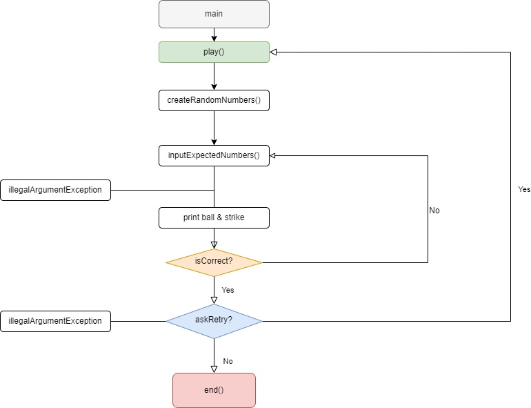

## 📄기능 목록!
- 메인 문에서 play()와 askContinue() 함수로 게임의 실행과 종료조건을 잡는다.
  1. play()는 구현하지 않고 종료 조건과 재시도의 여부를 물어보는 함수를 생성한다.
  2. 재시도를 할 경우 난수 생성 부분으로 돌아간다.
  3. 1 혹은 2가 아니라면 `IllegalArgumentException`을 발생시키고 종료한다.
- 난수를 생성한다.
  - 1~9사이의 숫자 3개를 리스트에 저장한다.
- 값을 입력 받고 예외처리를 한다.
  - 값을 리스트로 변경한다. 
  - 값이 숫자인지 확인한다.
  - 입력 값이 3자리인지 확인한다.
  - 입력 값에 중복이 있는지 확인한다.\
- 기댓값과 난수를 비교하고 볼과 스트라이크를 출력한다.  
## 순서도
