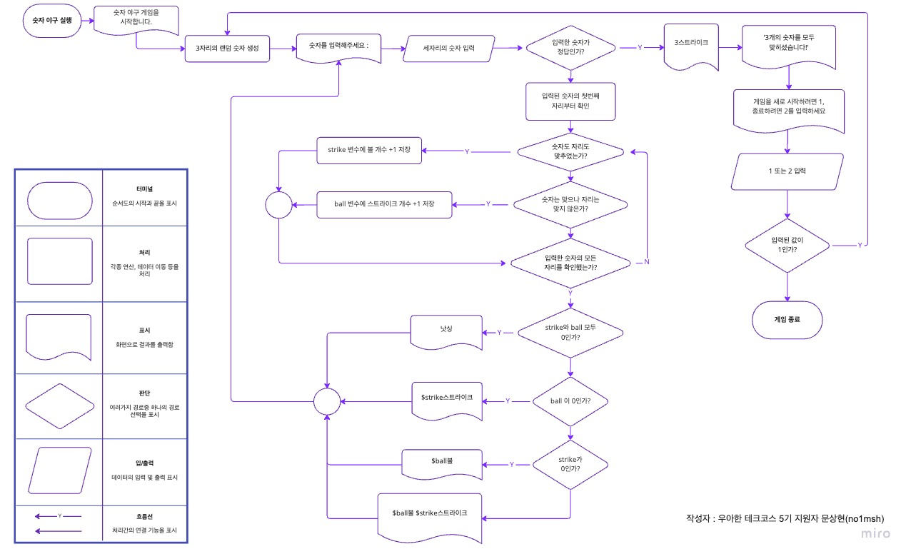

## 🎯기능 목록

1. 게임 시작 멘트 출력
2. 컴퓨터가 정답숫자를 랜덤으로 생성
3. 사용자가 숫자를 입력
4. 사용자가 입력한 숫자를 비교
   1. 사용된 숫자는 맞는데 자리가 틀릴 때
   2. 사용된 숫자도 자리도 맞추었을 때
   3. 사용된 숫자를 하나도 맞추지 못했을 때
5. 사용자가 정답숫자와 일치하게 입력한다면 축하 멘트 및 게임 재시작 의사 확인
6.  사용자가 잘못된 값을 입력할 경우 `IllegalArgumentException` 발생시킨 후 애플리케이션 종료

### 💭 숫자야구 게임의 큰 흐름을 한눈에 보기 위한 순서도

[🔍 순서도 웹에서 자세히보기 (위 이미지는 해상도가 낮습니다.)](https://miro.com/app/board/uXjVPHeookc=/?share_link_id=838782016592)

## ✅ 체크리스트

- [ ] kotlin 코드 컨벤션 가이드를 지켰는가?
- [ ] 변수, 또는 메소드 이름을 통해 의미를 전달 했는가?
- [ ] indent depth가 3이 넘지 않도록 구현 했는가?
- [ ] 메소드가 한 가지 일만 하는가?
- [ ] AssertJ를 이용하여 기능 목록이 정상 동작함을 테스트 코드로 확인 했는가?
- [ ] `camp.nextstep.edu.missionutils`에서 제공하는 API를 사용하여 구현 했는가?
- [ ] 깃 커밋 메시지 컨벤션 가이드를 지켰는가?